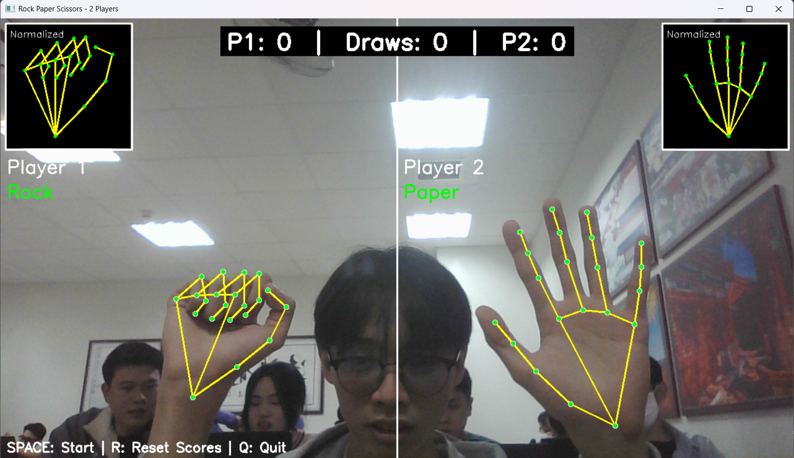
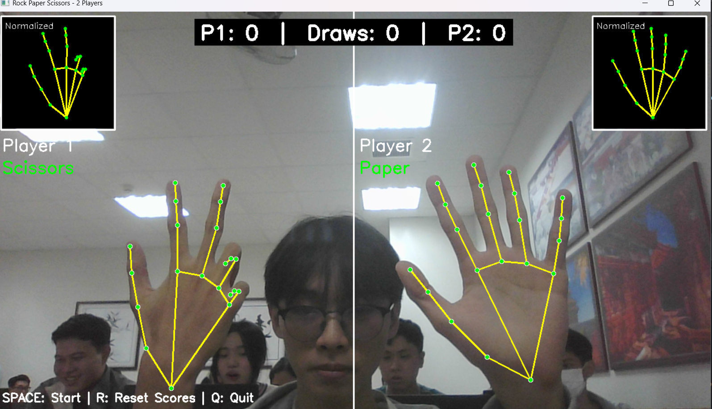
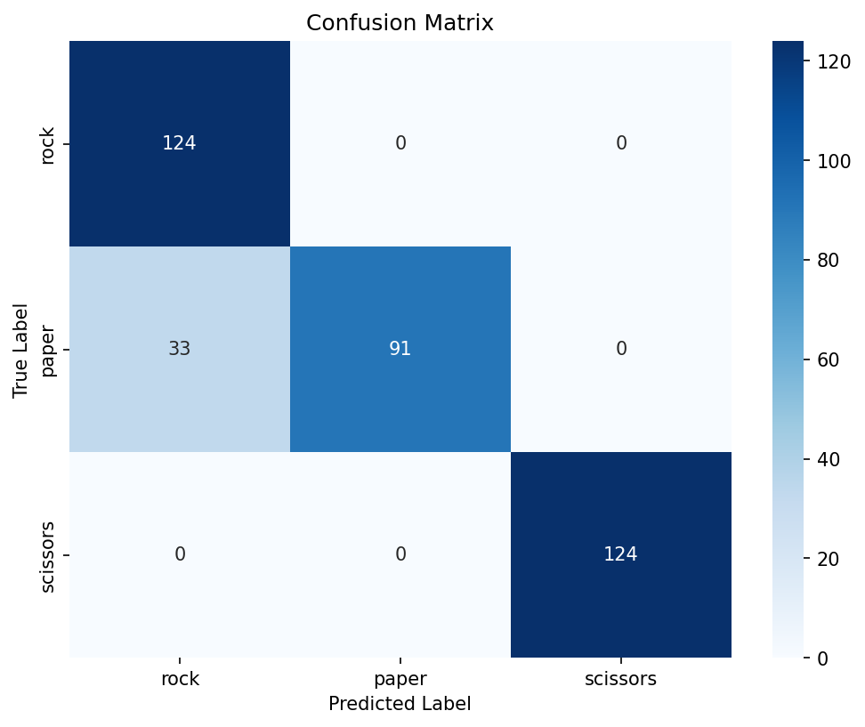

# 🎮 Rock Paper Scissors - Real-time Game

A real-time rock-paper-scissors game using **MediaPipe** for hand detection and **SVM** for gesture classification.

## ✨ Features

- **2-Player Split Screen** with real-time hand gesture recognition  
- **Hand Orientation Normalization** – works at any angle  
- **Visual Feedback** – shows normalized hand and skeleton  

## 🎯 Demo

| Rock vs Scissors | Rock vs Paper | Scissors vs Paper |
|:---:|:---:|:---:|
|  |  |  |

## 🚀 Quick Start

**Install dependencies:**
```bash
pip install opencv-python mediapipe scikit-learn joblib numpy matplotlib seaborn
```

**Train model:**
```bash
python train.py
```

**Play game:**
```bash
python main.py
```

## 🎮 Controls

- **SPACE** - Start countdown and play
- **R** - Reset scores
- **Q** - Quit

## 🔧 Tech Stack

- **Hand Detection**: MediaPipe
- **Classification**: SVM (RBF kernel)
- **Features**: 83 features (landmarks, distances, angles, palm spread)
- **Data Augmentation**: 3x training samples
- **Test Accuracy**: ~91.67%

## 📊 Model Performance

| Class    | Precision | Recall | F1-Score |
|----------|-----------|--------|----------|
| Rock     | 0.80      | 1.00   | 0.89     |
| Paper    | 1.00      | 0.75   | 0.86     |
| Scissors | 1.00      | 1.00   | 1.00     |

---


**Overall Accuracy:** **91.67%**  
**Best Params:** `C=1`, `gamma='scale'`, `kernel='rbf'`  
**Cross-validation Mean Score:** **0.9998 ± 0.0004**

Confusion matrix:  

